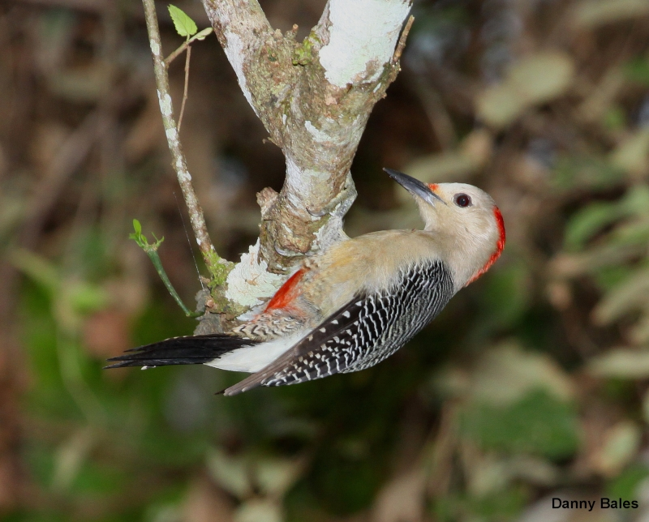

## Population genomics of _Centurus santacruzi_ Complex

 

This repository corresponds the manuscript "The tangled evolutionary history of the Mesoamerican Velazquez Woodpecker complex (Centurus santacruzi, Aves: Picidae) revealed by using Next Generation Sequencing data" (in prep.). 

**Background**  
The Velazquez woodpecker Centurus santacruzi (Aves: Picidae) is a polytypic species distributed from the center-east regions of Mexico to North Nicaragua and Honduras islands (Howell and Webb, 1995). The ample morphological differentiation throughout its distribution has provoked the taxonomic recognition of several subspecies grouped in three main groups: santacruzi, dubius and polygrammus(Ridgway, 1914; Peters, 1948; Selander and Giller, 1963; AOU 1998). Previous molecular studies have shown the close phylogenetic relationship of this complex with the Golden-fronted woopecker (C. aurifrons) and the Red-bellied woodpecker (C. carolinus); however, they fail to fully-resolve the evolutionary relationships among the subspecies (García-Trejo et al 2009, Navarro-Siguenza et al 2017). Herein, we employed NextRAD sequences (single-end 150 bp reads generated with Illumina HiSeq4000) for analyzing the genetic diversity and structure within the morphotypes of the complex, and the correspondence of this variation with geography and ecology
  
This repository includes the data and scripts generated for the manuscript (preprocessing of samples, cleaning of matrices and population structure analyses) and is structured in three directories: _bin_, _data_, _results_ and _meta_. The content of each directory is delailed below.
   
## `/bin`
**[_bin_](/bin)** contains the parameter configuration file to run ipyrad and four scripts for analyses illustrated in the following figure;    
  
 
  

**[_1-run_trimmomatic.sh_](/bin/1-run_trimmomatic.sh)** runs a loop for executing trimmomatic on raw samples, specifically the function slidingwindow. Slidingwindow starts scanning at the 5´ end and clips the readonce the average quality within the window (4 bp) falls below a quality threshold (20). Before executing this script we obtained information on the samples quality and adapter content with [FASTQC](http://www.bioinformatics.babraham.ac.uk/projects/fastqc/) with default parameters.**(Raw data is not included in the repository, so this script cannot be executed).**   
**[_2-run_ipyrad.sh_](/bin/2-run_ipyrad.sh)**
runs ipyrad, an interactive assembly and analysis toolkit for restriction-site associated DNA (RAD-seq) and related data types. Configuration parameters are specified in *params-run_w_refgen.txt* **(Clean data is not included in the repository, so this script cannot be executed).**   
**[_3-run_vcftools.sh_](/bin/3-run_vcftools.sh)** for filtering individuals and SNPs sites containing a maximun of 30% of missing data and write in a new vcf file; as well as calculating allele frequency, HWE statistics and inbreeding coefficient **(run first).**    
**[_4-run_plink.sh_](/bin/4-run_plink.sh)** runs a basic command for converting .vcf format to .plink **(run once vcftools instructions are completed).**    
**[_5-PCA&Structure.R_](/bin/5-PCA&Structure.R)** contains a script for performing Principal Components and Structure-like Analyses, as well as a test of outlier loci in the sample **(run when plink and vcftools outputs have been obtained).**  
  
**The software version employed are:  
[Trimmomatic](http://www.usadellab.org/cms/?page=trimmomatic) V0.39  
[iPyrad](https://ipyrad.readthedocs.io/en/latest/index.html)  
[VCFTools](https://vcftools.github.io/) V0.1.16  
[PLINK](http://zzz.bwh.harvard.edu/plink/) v1.90b6.18**  

## `/data`
**[_data_](/data)** contains three directories *1.raw*, *2.ipyrad_outputs* and *3.clean_matrix*.  

1. raw contains the raw data as obtained by sequencing service
2. ipyrad_outputs includes the main output formats generated by ipyrad with parameters specified in 
3. clean matrix contains the final matrix obtained by filtering process with [vcftools](https://vcftools.github.io/), which constitute the input file for the subsequent population genomic analyses;  

## `/meta`
**[_meta_](/meta)** contains metadata of sequenced individuals (needed to run the filtering individuals option of vcftools).  The info contained in the metadata file include the Scientific name according to the [American Ornithological Union](https://americanornithology.org/publications/north-and-middle-american-checklist/), State of collection (in Mexico), Specimen Code, Latitude and Longitude.
  
## `/results`
**[_results_](/results)** contains

##
  
***Cited Literature***  
García-Trejo, E. A., De Los Monteros, A. E., Arizmendi, M. D. C., & Navarro-Siüenza, A. G. (2009). Molecular systematics of the red-bellied and golden-fronted woodpeckers. The Condor, 111(3), 442-452.  
Howell, S. N., & Webb, S. (1995). A guide to the birds of Mexico and northern Central America. Oxford University Press.  
Navarro-Sigüenza, A. G., Vázquez-Miranda, H., Hernández-Alonso, G., García-Trejo, E. A., & Sánchez-González, L. A. (2017). Complex biogeographic scenarios revealed in the diversification of the largest woodpecker radiation in the New World. Molecular phylogenetics and evolution, 112, 53-67. 
Ridgway, R. (1914). The Birds of North and Middle America: A descriptive catalogue of the higher groups, genera, species, and subspecies of birds known to occur in North America, from the Arctic Lands to the Isthmus of Panama, the West Indies and Other Islands of the Caribbean Sea, and the Galapagos Archipelago (No. 50). US Government Printing Office.  
Selander, R. K., & Giller, D. R. (1963). Species limits in the woodpecker genus Centurus (Aves). Bulletin of the AMNH; v. 124, article 6.

 
