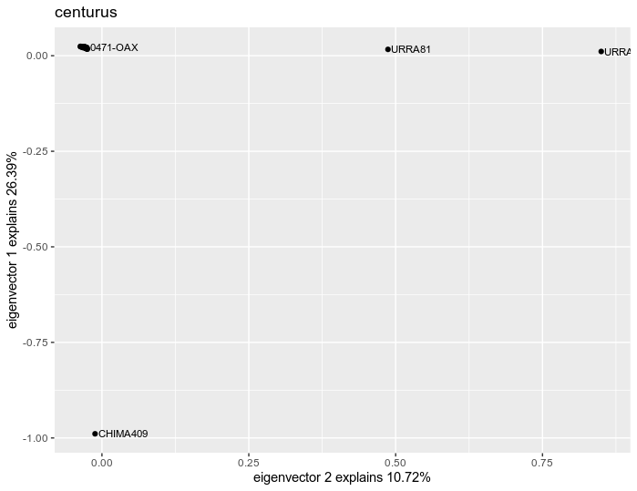
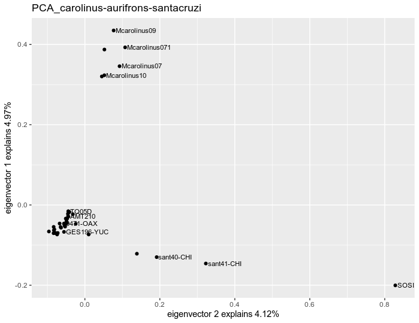
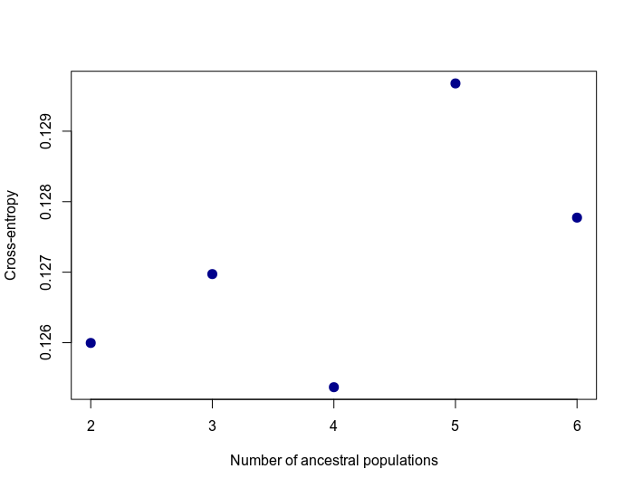

**NextRAD sequencing, filtering and SNPs calling**.- We obtained an average 200 Megabases of sequence data, equivalent to ~ 2.3 million of 150 base-pair reads, from each NextRAD sample library. From these libraries, were obtained on average per sample, 2 280 924 reads mapped to the Centurus aurifrons genome yielding 225 423 clusters and 17 740 loci in final assembly. After filtering the ipyrad SNP matrix for alleles in maximum frequency of 5%, paralogues, and sites/individuals with more than 30% of missing data, we obtained a final matrix of 48 individuals (3 outgroups, 5 _C. carolinus_, 5 _C. aurifrons_ and 35 _C. santacruzi_) and up to 3 000 SNPs. 
  
**Population structure**.-  For PCA we employed samples of individuals form _C. carolinus_, _C. aurifrons_, _C. santacruzi_, and outgroups and the information of 897 unlinked SNPs. The first 10 components explained near to the 10 % of the total genomic variation. We generated three sucesive PCAs  by eliminating the outgropus, C. carolinus groups, and C.santacruzi for disentangling the structure of genetic variation in the cluster. When removing outgrups (2nd PCA), three main clusters appeared:  (1) _C. carolinus_, (2) _C. s. santacruzi_, and (3) _C. s. polygrammus-veraecrucis-grateloupensis-dubius_. Considering only this last cluster (3er PCA), we obtained a subdivision between _C.s. dubius_ and _C. s. polygrammus-veraecrucis-grateloupensis_.
  

  
We performed structure-like analyses in LEA with the dataset containing only _C. aurifrons_ and _C. santacruzi_. We obtained that the most probable number of populations, inferred by the entropy criterion, is K = 4. When plotted the admixture coefficient by individuals we recovered four genetically differentiated groups including samples corresponding to _C. aurifrons_(in gray), _C.s.  santacruzi_(dark blue) and _C. s. dubius_ (ligth blue) subspecies, and _C. s. polygrammus-veraecrucis-grateloupensis_ (blue). These groups although appear as genetically differentiated, most of individuals have an important component of genetic information from other entities.
  

